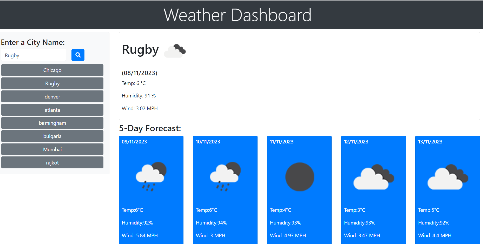

## description
OpenWeather API is used to retrieved the required weather data.

user can see daily and forcast weather.

This is a weather dashboard that will allow a user to search for a city and display the weather results.

The weather is displayed using the OpenWeatherMap API.

JQuery event listeners are used to identify when a user wishes to search for a city.

User needs to enter a valid city name.

The user's search history is displayed in the left column. The current weather will be displayed at the top right section and the 5-day forecast will display below current.

The current weather data includes an icon, current temp, humidity, wind speed.

The 5-day forecast includes the date, icon, daily temp, wind and humidity.

The last searched city will be saved in local storage. The next time the user opens the weather dashboard, their last searched city will display with current weather information.

Day.js is used to convert unix timestamp to MM/DD/YYYY format.

screenshot: 

## Website
https://lalitakapadia.github.io/weather-dashboard/